# CSC12002 - DA#3: Dental Clinic Management System - Client

This is the repo for the client source code of the Dental Clinic project for the course CSC12002 - Advanced Database at HCMUS.

## Tech stack

- Ant Design Pro

## Server

The repo for the server can be found [here](https://github.com/nhthieu/dental-clinic-server).

## Database

The repo for the client can be found [here](https://github.com/nhthieu/dental-clinic-database).

## Contributors

- [Hieu Nguyen Ho Trung](https://github.com/nhthieu)
- [Nam Vu Hoai](https://github.com/namhoai1109)
- [Man Nguyen Huynh](https://github.com/nhman2002)
- [Trung Thieu Vinh](https://github.com/tvtrungg)

## Diagram

```mermaid
graph TD
    %% User and assets
    User["User (Browser)"]:::external
    StaticAssets["Static Assets (public/)"]:::front
    click StaticAssets "https://github.com/tvtrungg/clinic-client/tree/main/public/"

    %% Front-End Application
    subgraph "Front-End Application"
        direction TB

        %% Bootstrap & Global Config
        AppBootstrap["Application Bootstrap (src/app.tsx)"]:::front
        click AppBootstrap "https://github.com/tvtrungg/clinic-client/blob/main/src/app.tsx"
        GlobalWrappers["Global Wrappers & Context (src/global.tsx)"]:::front
        click GlobalWrappers "https://github.com/tvtrungg/clinic-client/blob/main/src/global.tsx"
        ClientProvider["ClientProviderLayout (src/components/ClientProvider/ClientProviderLayout.tsx)"]:::front
        click ClientProvider "https://github.com/tvtrungg/clinic-client/blob/main/src/components/ClientProvider/ClientProviderLayout.tsx"
        PermissionControl["Permission Control (src/access.ts)"]:::front
        click PermissionControl "https://github.com/tvtrungg/clinic-client/blob/main/src/access.ts"

        %% Routing & Theming
        Routing["Routing & Navigation (config/routes.ts)"]:::front
        click Routing "https://github.com/tvtrungg/clinic-client/blob/main/config/routes.ts"
        ThemeProvider["Theme Provider & Theming (config/themeProvider.ts)"]:::front
        click ThemeProvider "https://github.com/tvtrungg/clinic-client/blob/main/config/themeProvider.ts"
        ProxyConfig["Proxy Config (config/proxy.ts)"]:::front
        click ProxyConfig "https://github.com/tvtrungg/clinic-client/blob/main/config/proxy.ts"
        OneAPI["OneAPI Config (config/oneapi.json)"]:::front
        click OneAPI "https://github.com/tvtrungg/clinic-client/blob/main/config/oneapi.json"
        DefaultSettings["State Managers & Settings (config/defaultSettings.ts)"]:::front
        click DefaultSettings "https://github.com/tvtrungg/clinic-client/blob/main/config/defaultSettings.ts"

        %% UI Layer
        subgraph "UI Layer"
            direction TB
            Components["Reusable Components (src/components/)"]:::front
            click Components "https://github.com/tvtrungg/clinic-client/tree/main/src/components/"
            subgraph "Pages (Feature Modules)"
                direction TB
                LoginPage["Login Module (src/pages/Login/)"]:::front
                click LoginPage "https://github.com/tvtrungg/clinic-client/tree/main/src/pages/Login/"
                AdminPage["Admin Module (src/pages/Admin/)"]:::front
                click AdminPage "https://github.com/tvtrungg/clinic-client/tree/main/src/pages/Admin/"
                DentistPage["Dentist Module (src/pages/Dentist/)"]:::front
                click DentistPage "https://github.com/tvtrungg/clinic-client/tree/main/src/pages/Dentist/"
                StaffPage["Staff Module (src/pages/Staff/)"]:::front
                click StaffPage "https://github.com/tvtrungg/clinic-client/tree/main/src/pages/Staff/"
                PortalPage["Patient/Portal Module (src/pages/Portal/)"]:::front
                click PortalPage "https://github.com/tvtrungg/clinic-client/tree/main/src/pages/Portal/"
                NotFound["404 Page (src/pages/404.tsx)"]:::front
                click NotFound "https://github.com/tvtrungg/clinic-client/blob/main/src/pages/404.tsx"
            end
        end

        %% Business & API Layer
        subgraph "API Layer"
            direction TB
            LoginSvc["Login Services (src/services/login/services.ts)"]:::front
            click LoginSvc "https://github.com/tvtrungg/clinic-client/blob/main/src/services/login/services.ts"
            AdminSvc["Admin Services (src/services/admin/services.ts)"]:::front
            click AdminSvc "https://github.com/tvtrungg/clinic-client/blob/main/src/services/admin/services.ts"
            StaffSvc["Staff Services (src/services/staff/services.ts)"]:::front
            click StaffSvc "https://github.com/tvtrungg/clinic-client/blob/main/src/services/staff/services.ts"
            CustomerSvc["Customer Services (src/services/customer/services.ts)"]:::front
            click CustomerSvc "https://github.com/tvtrungg/clinic-client/blob/main/src/services/customer/services.ts"
            Callers["Service Callers (src/services/*/callers.ts)"]:::front
            click Callers "https://github.com/tvtrungg/clinic-client/blob/main/src/services/*/callers.ts"
            Paths["Service Paths (src/services/*/paths.ts)"]:::front
            click Paths "https://github.com/tvtrungg/clinic-client/blob/main/src/services/*/paths.ts"
        end

        %% Utilities and Shared
        subgraph "Utilities & Shared"
            direction TB
            Utils1["convertData (src/utils/convertData.ts)"]:::front
            click Utils1 "https://github.com/tvtrungg/clinic-client/blob/main/src/utils/convertData.ts"
            Utils2["localStorage (src/utils/localStorage.ts)"]:::front
            click Utils2 "https://github.com/tvtrungg/clinic-client/blob/main/src/utils/localStorage.ts"
            Utils3["routing Helpers (src/utils/routing.ts)"]:::front
            click Utils3 "https://github.com/tvtrungg/clinic-client/blob/main/src/utils/routing.ts"
            Constants["Constants (src/constants/)"]:::front
            click Constants "https://github.com/tvtrungg/clinic-client/tree/main/src/constants/"
            Locales["Internationalization (src/locales/)"]:::front
            click Locales "https://github.com/tvtrungg/clinic-client/tree/main/src/locales/"
            Types1["Global Types (src/typings.d.ts)"]:::front
            click Types1 "https://github.com/tvtrungg/clinic-client/blob/main/src/typings.d.ts"
            Types2["Type Index (types/index.d.ts)"]:::front
            click Types2 "https://github.com/tvtrungg/clinic-client/blob/main/types/index.d.ts"
        end

        %% PWA & Tests
        ServiceWorker["Service Worker (src/service-worker.js)"]:::front
        click ServiceWorker "https://github.com/tvtrungg/clinic-client/blob/main/src/service-worker.js"
        JestConfig["Jest Config (jest.config.ts)"]:::front
        click JestConfig "https://github.com/tvtrungg/clinic-client/blob/main/jest.config.ts"
    end

    %% Mock and Prod API
    MockServer["Mock Server (mock/route.ts)"]:::mock
    click MockServer "https://github.com/tvtrungg/clinic-client/blob/main/mock/route.ts"
    BackendAPI["Dental Clinic API Server"]:::external
    Database["Database"]:::db

    %% Data Flows
    User --> StaticAssets --> AppBootstrap --> GlobalWrappers --> ClientProvider
    ClientProvider --> PermissionControl --> Routing --> ThemeProvider --> DefaultSettings
    Routing --> LoginPage & AdminPage & DentistPage & StaffPage & PortalPage & NotFound
    LoginPage & AdminPage & DentistPage & StaffPage & PortalPage --> Components
    Pages --> LoginSvc & AdminSvc & StaffSvc & CustomerSvc
    LoginSvc & AdminSvc & StaffSvc & CustomerSvc --> Callers --> Paths
    Callers --> MockServer
    Callers --> BackendAPI
    BackendAPI --> Database
    Utils1 & Utils2 & Utils3 & Constants & Locales --> Components
    ServiceWorker --> AppBootstrap

    %% Styles
    classDef front fill:#E0F7FA,stroke:#006064,color:#004D40
    classDef mock fill:#E8F5E9,stroke:#2E7D32,color:#1B5E20
    classDef external fill:#FFF3E0,stroke:#EF6C00,color:#E65100
    classDef db fill:#ECEFF1,stroke:#455A64,color:#37474F
    class User,BackendAPI external
    class StaticAssets,AppBootstrap,GlobalWrappers,ClientProvider,PermissionControl,Routing,ThemeProvider,ProxyConfig,OneAPI,DefaultSettings,Components,LoginPage,AdminPage,DentistPage,StaffPage,PortalPage,NotFound,LoginSvc,AdminSvc,StaffSvc,CustomerSvc,Callers,Paths,Utils1,Utils2,Utils3,Constants,Locales,Types1,Types2,ServiceWorker,JestConfig front
    class MockServer mock
    class Database db

```

